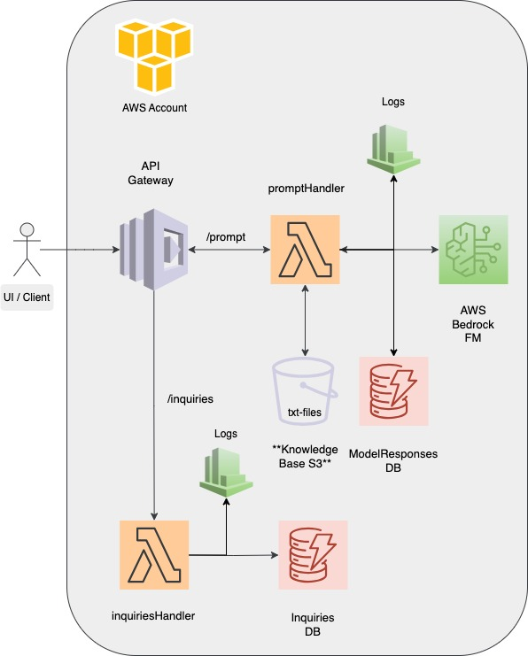

# AI Assistant with Amazon Bedrock and AWS CDK

A reusable, AWS CDK-defined (IAC) backend infra for creating (RAG) based AI assistants using Amazon Bedrock's pre selected Foundation Model (FM) with your own knowledge base as e.g. text files. The project is designed to be easily extendable and reusable, allowing you to create your own small scalge AI assistants with minimal effort.

## Initial used FM

- ```amazon.titan-text-premier-v1:0``` - the default foundation model (FM) used in this project. You can easily switch to another FM by changing the model ID in the Stack and Lambda code. You can find more from FMs from [here](https://aws.amazon.com/bedrock/) and check the latest available models.

- Note that Titan will use primarily English as the language, but it can also understand and respond in other languages. You can use the model to generate text in different languages by providing the input in the desired language. However, the quality of the output may vary depending on the language and the specific model used.

- Note generally that some of models are not available in all regions, so make sure to check the availability of the models in your region. Note that e.g. Claude can be pretty needy for context, so you might need to use a different model if you have a lot of content in your knowledge base. Find more information from Titan models from [here](https://docs.aws.amazon.com/bedrock/latest/userguide/model-parameters-titan.html).

## Architecture



## Components

- **API Gateway** – receives external requests, secured with API key
- **Lambda (TypeScript)** – builds the prompt and calls Bedrock
- **S3** – stores the knowledge base (e.g. TXT, JSON, etc.) 
- **Amazon Bedrock** – generates answers using a selected foundation model

## Optional Components (WIP)

These are for additional feature from UI app side, if you want to store requests from user.
- **DynamoDB table** – stores user requests and responses as optionalDataTable
- **Lambda (TypeScript)** – stores messages to DynamoDB table
- **API Gateway** – receives external requests, secured with API key - invokes the Lambda function to store messages

## Deployment with AWS CDK
- ```cdk synth``` – synthesizes the CloudFormation template
- ```cdk deploy``` – deploys the stack to your AWS account
- ```cdk destroy``` – destroys the stack and removes all resources
- ```cdk diff``` – shows the differences between the deployed stack and the local stack

## Security notation

**The selected FM model does not learn from your data.** Content in the Knowledge Base is not used to train the foundation model. Amazon Bedrock guarantees that customer-provided documents remain private and are not shared, stored, or used for training any underlying model. For sensitive data use cases, configure S3 permissions, VPC access, and API security appropriately.

Just wanted to write that down, because I have seen some people being worried about the data privacy and security when using AI services generally.

## Getting Started

1. Create an AWS account, make also sure you don't use ROOT user, because it's not a good practice. This is maybe the bigges part of the setup, because you need to provide your credit card information. If you have an existing AWS account, create IAM user to have programmatic access to AWS account / services.
2. Install AWS CLI if you don't have it already. You can find the installation instructions [here](https://docs.aws.amazon.com/cli/latest/userguide/getting-started-install.html). You can use Homebrew too if you are on MacOS: ```brew install awscli```
3. Configure AWS CLI with your credentials ```aws configure``` 
4. Now you can run e.g. command ```aws s3 ls``` to check that you have access to your AWS account.
5. Before running deployments, make sure to run ```cdk bootstrap aws://<account-id>/<region>``` to set up the environment for CDK.
6. Set your account ID and region to the file ```bedrock-rag-agent-cdk.ts``` that defines the CDK app. You can find your account ID from the AWS console. Please make sure also that you wont push those changes to the repo, because they are sensitive information. You can use .env file or something similar to store those values (wip).
6. After configs & bootstrapping, you can run ```cdk deploy``` to deploy the stack. This will create all the resources defined in the CDK stack.
6. Remember now include the **profiledetails.txt** named file to the S3 bucket.
7. After this you are good to go to call API and start messing around with the AI assistant and your knowledge. You can use Postman or any other API testing tool to call the API endpoint. The API key is required for authentication, so make sure to include it in the request headers. You can find the API key in the AWS API Gateway console.

## Roadmap

### Basic infra

- [x] 1. Create empty AWS CDK project
- [x] 2. Create empty Lambda function that responds with "Hello World"
- [x] 3. Create API Gateway endpoint with API key protection
- [x] 4. Test API Gateway with Postman

### Knowledge base and S3

- [x] 5. Create S3 bucket for knowledge base markdown documents
- [x] 6. Allow Lambda to access S3 bucket and fetch documents
- [x] 7. Read markdown content from S3 and parse it into a single string

### Bedrock-integration and configuration

- [x] 8. Initialize / study Bedrock connection from Lambda
- [x] 9. Create Lambda logic to call Bedrock Claude with constructed prompt
- [x] 10. Test Bedrock-powered Lambda with real markdown content via Postman
- [ ] 11. Add env file support for model ID, account ID, default region, and S3 bucket name...

### Testing and scaling

- [ ] 12. Create unit tests for eact Lambda function

### UI (optional, not to this repo)

- [ ] 13. Create lightweight NextJs UI for rendering the assistant
- [ ] 14. Add selection for topic and response language in UI
- [ ] 15. Host UI in S3 static website
- [ ] 16. Serve UI through CloudFront with HTTPS (optional)

### Docs 

- [x] 17. Draw architecture diagram (e.g. draw.io)
- [x] 18. Add architecture image to README


## License

MIT – use and extend freely!